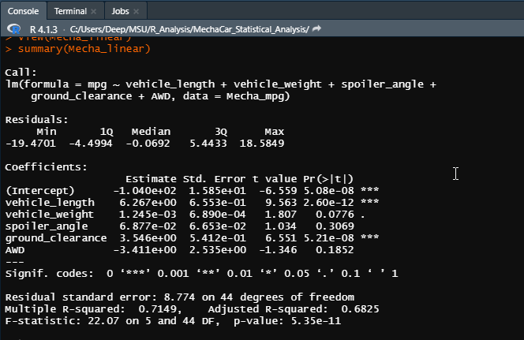
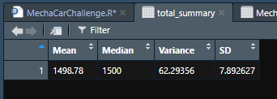
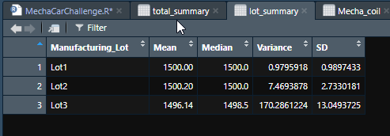
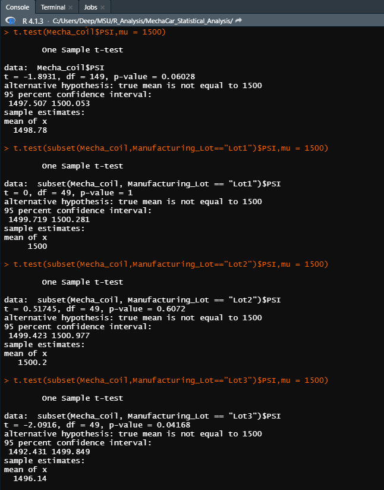

# MechaCar_Statistical_Analysis

## Overview

The purpose of this analysis is to offer insights to MechaCar's manufacturing team which should help them understand the reason(s) behind the production troubles of the newest prototype, AutosRU's. In order to conduct this analysis, the aim is to utilise **R & R-Studio** to help Jeremy by using two datsets containing information related to the miles per gallon and the suspension coils of the MechaCar. The dplyr library is also used to complete this analysis.

## Linear Regression to Predict MPG

In this section, the `dplyr` library was loaded. Then the MechaCar miles per gallon dataset was imported. From there, a multiple linear regression was carried out to understand the relationship between the miles per gallon (mpg) with the other factores in the dataset like the vehicle length, vehicle weight, spoiler angle, ground clearance, and all wheel drive (AWD). Here are the summary results from the linear regression,
### Miles Per Gallon Linear Regression

*a. Summary of Multiple Linear Regression*

Some of the key points are,

1. There were two variables that have extremely small p-value meaning that they had a high level of significance: **The vehicle_length and the ground_clearance**. However, a result being statistically significant does not imply that it is non-random, just that the probability of its being random is greatly reduced. It also should be noted that the intercept as had a high level of significance meaning that there are still other factors contributing to the variance of the miles per gallon of the MechaCar. 
2. The linear regression results above show that some of the independent variables had a significant effect on the dependent variable. Thus, the slope of the linear model is **not** considered to be zero. Also, the R-value of the regression is 0.71 whereas for the slope to be zero, the R-value had to be zero or close to zero. 
3. The R-squared value should be a good indicator of whether the linear model predicts the mpg of the MechaCar. In this case, it is at 0.7149 meaning that this model would predict the mpg of the MechaCar correctly 71% of the time. Any R-squared value above 0.5 is generally considered to be effective so the above linear regression  model would be considered **effective**.

Here are the summary results from the linear regression.

## Summary Statistics on Suspension Coils

In this section, the suspension coils dataset was imported. It  comprised of 150 different vehicles in 3 different lot numbers and corresponding PSI levels for each vehicle. Two summary tables to look at the mean, median, variance, and standard deviation of data were created. The first table looked at the data as a whole, while the second table looked specific at each of the three different lots that the MechaCars were divided into. Here are the two tables.

### Summary Table of Suspension Coils

*b. Summary of all Suspension Coils*

*c. Summary of Suspension Coils by Lot*

To meet the design specifications for MechaCar suspension coils, the **variance of the suspension coils must not exceed 100 pounds per square inch**. From the data above,

1. Looking at the **total** summary, the current variance is approximately 62.293 PSI meaning that is **does meet the design specification**.

2. When looking at the individual lots, Lot1 and Lot2 meet the design specification with a varaince of approximately 0.979 PSI and 7.469 PSI respectfully, but **Lot3 does not**. This is becasue the third lot's variance is approximately 170.286 PSI, **exceeding** the design specification of 100 PSI. Therefore, the manufacturing team should work with Lot 1 and 2 and **exclude Lot 3 in order to comply with specifications**.

## T-Tests on Suspension Coils

In this section, t-tests were performed to determine if all manufacturing lots and each lot individually are statistically different from the population mean of 1,500 pounds per square inch. In order to do this, R's t.test() function was used to find four different p-values. The results of the analysis is below,
### Summary Table of t-test

*d. Summary of all t-test*

From the above results, the **p-value** of the tests are as follows:

1. t-test to compare all manufacturing lots against mean PSI: **p-value: 0.060**

2. t-test to compare Lot1 against mean PSI: **p-value: 1.0**

3. t-test to compare Lot2 against mean PSI: **p-value: 0.607**

4. t-test to compare Lot3 against mean PSI: **p-value: 0.041**

By using a significance level of 95%, meaning that 95% of the time this tests results would be true, it translates to a the fact that **if p-value is 0.05 or lower, the result is significant, but if it is higher than 0.05, the result is non-significant**.

After reviewing the tests, it is clear that for only **Lot 3 the alternate hypothesis of true mean not equalling calculated mean of 1,500 PSI holds. For the rest of cases, p-values are greater than .05 meaning that we do not have sufficient evidence to reject the null hypothesis, and  we would state that the two means are statistically similar.**

## Study Design: MechaCar vs Competition

In this section, we want to design a statistical study to compare performance of the MechaCar vehicles against performance of vehicles from other manufacturers. In order to do this we want to cover the below aspects of the design of the test,

1. The metric we want to test is the Maintenance cost of MechaCar against the competition.

2. The Null Hypothesis for the test is that maintenance cost has no relationship among the differnt classes of cars and competing cars have the same maintenance cost. 

The Alternative Hypothesis is that they are significant difference in maintenance cost among the different vehicles in the same class and it has a significant relationship with aspects like vehicle weight and manufacturer or manufacturing process.

3. I would use a combination of Multiple Linear Regression and ANOVA test to complete this analysis. Multiple Linear Regression would be used to identify the significant and non-significant variables which impact maintenance cost. ANOVA would be used to  determine if there is a statistical difference between the distribution of maintenance cost from multiple cars that are competing with MechaCar based on vehocle class. Also we would use the ggplot2 library and drow boxplots to show the potential spread between different cars.

4. We would need the maintenance cost data from atleast 100 individual vehicles to create a sample size of data for each car in the class type to be statistically significant. Also we would need various other data points of vehicles like vehicle dimensions, weight, manufacturer, chasis type, manufacturing process, engine type, fuel type, drive to understand the relationship of factors that affect maintenance cost. 